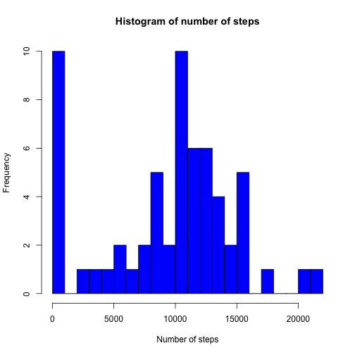
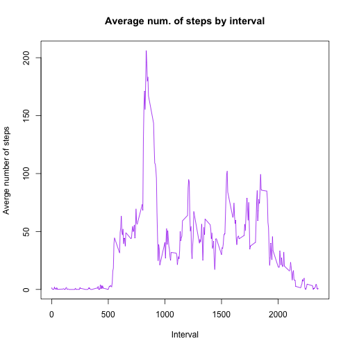
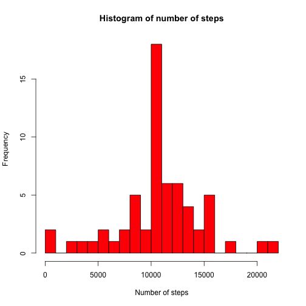
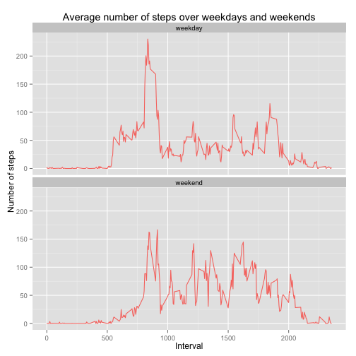

## Loading and preprocessing the data


The data for this assignment is loaded in the work space as a csv file. We receive it as a zip file, so we unzip it and load it, and we call the libraries needed for the whole assignment:


```r
library(dplyr)
library(ggplot2)
```


```r
unzip("activity.zip")
inputData <- read.csv("activity.csv")
```

## What is mean total number of steps taken per day?

To answer this, we first need to group the data by date:


```r
a <- group_by(inputData, date)
```

Then we calculate the total number of steps taken per date:

```r
b <- summarize(a, steps= sum(steps, na.rm=T))
```

And we make a histogram of the total number of steps taken each day. NOTE: We were asked to plot a histogram, not a barplot.


```r
hist(b$steps, breaks=20, xlab="Number of steps", ylab="Frequency", 
     main="Histogram of number of steps", col="blue")
```

 

Finally, we calculate and report the mean and median of the total number of steps taken per day:


```r
mean(b$steps)
```

```
## [1] 9354.23
```

```r
median(b$steps)
```

```
## [1] 10395
```

## What is the average daily activity pattern?

To answer this, we need to make a time series plot (i.e. type = "l") of the 5-minute interval (x-axis) and the average number of steps taken, averaged across all days (y-axis). 

So this time, we group the data by interval, and we calculate the mean of the number of steps for each interval:


```r
c <- group_by(inputData, interval)
d <- summarize(c, meanSteps= mean(steps, na.rm=T))
```

And then we plot the data to see the average daily activity pattern: 


```r
with(d, plot(interval, meanSteps, type="l", xlab="Interval", ylab="Averge number of steps", 
             col="purple", main="Average num. of steps by interval"))
```

 

Which 5-minute interval, on average across all the days in the dataset, contains the maximum number of steps?


```r
d$interval[which.max(d$meanSteps)]
```

```
## [1] 835
```

## Imputing missing values

Here, we calculate and report the total number of missing values in the dataset (i.e. the total number of rows with NAs):


```r
sum(is.na(inputData$steps))
```

```
## [1] 2304
```

And we devise a strategy for filling in all of the missing values in the dataset. The strategy does not need to be sophisticated. For example, we could use the mean/median for that day, or the mean for that 5-minute interval, etc.

We create a new dataset (df) that is equal to the original dataset but with the missing data filled in, using the mean value of the number of steps in their corresponding interval:


```r
df <- inputData
df$steps[is.na(df$steps)] <- with(df, ave(steps, interval, 
   FUN = function(x) mean(x, na.rm = TRUE)))[is.na(df$steps)]
```

Then we make a histogram of the total number of steps taken each day and we calculate and report the mean and median of the total number of steps taken per day. To do this, we first group the data frame by date: 


```r
x <- group_by(df, date)
```

Then we calculate the total number of steps taken per day. Here we don't need to exclude NA values as we did before, since we substituted them with the mean of the number of steps per interval.


```r
y <- summarize(x, steps= sum(steps))
```


And finally we create the histogram of the total number of steps taken each day:

```r
hist(y$steps, breaks=20, xlab="Number of steps", ylab="Frequency", 
     main="Histogram of number of steps", col="red")
```

 

The mean and median values are:

```r
mean(y$steps)
```

```
## [1] 10766.19
```

```r
median(y$steps)
```

```
## [1] 10766.19
```

We can see that the values of the mean and median have now increased compared to the values we had beofre, and this is due to the fact that we now have data where there was no data before. The added values of course increase the average values in the data frame.


## Are there differences in activity patterns between weekdays and weekends?

We create a new factor variable in the dataset with two levels – “weekday” and “weekend” indicating whether a given date is a weekday or weekend day.


To do this, I first add a column with the name of the day just to be able to compare it with the next new column that has the value of weekday or weekend and see if it corresponds correctly. This is not needed, but gives a nice visual correspondance:


```r
df$day <- weekdays(as.Date(df$date))
```

Now I add the column that indicates wether the date is a weekday or a weekend day:


```r
df$wend <- as.factor(ifelse(weekdays(as.Date(df$date)) %in% c("Saturday","Sunday"), "Weekend", "Weekday")) 
```

And we make a panel plot containing a time series plot (i.e. type = "l") of the 5-minute interval (x-axis) and the average number of steps taken, averaged across all weekday days or weekend days (y-axis). The obtained plot is similar to the one in the README file in the GitHub repository that was given to us as an example of what this plot should look like using simulated data.

To do the plot, we create two new data frames, called MeanWeekday and MeanWeekend, where we have filtered the days into week days and weekend days respectively. In each data frame, the data has been grouped by interval and shows the mean value of the steps for each interval:


```r
weekdays <- filter(df, wend == "Weekday")
weekdays <- group_by(weekdays, interval)
MeanWeekday <- summarize(weekdays, meanSteps = mean(steps))


weekends <- filter(df, wend == "Weekend")
weekends <- group_by(weekends, interval)
MeanWeekend <- summarize(weekends, meanSteps = mean(steps))
```

Then we merge both data frames into a new and final data frame called FinalDF:


```r
MeanWeekday2 <- mutate(MeanWeekday, wend="weekday")
MeanWeekend2 <- mutate(MeanWeekend, wend="weekend")
FinalDF <- rbind(MeanWeekday2, MeanWeekend2)
```

And we create the time series plot (i.e. type = "l") of the 5-minute interval (x-axis) and the average number of steps taken, averaged across all weekday days or weekend days:
(y-axis)

```r
ggplot(FinalDF, aes(x=interval, y=meanSteps, colour="#000099")) + 
        geom_line() + 
        facet_wrap(~ wend, ncol=1) +
        guides(colour=FALSE) +
        labs(title="Average number of steps over weekdays and weekends", 
             x="Interval", y="Number of steps")
```

 

We can see from the plot, that the number of steps made in the weekend decrease in the first time intervals (until before 8am more or less), compared to the ones made during the weekdays. But after around 8am, the number of steps is similar or sometimes even slightly higher than those made during the weekdays, and decreases until around 10pm, while in the weekdays it decreases at around 8pm.
